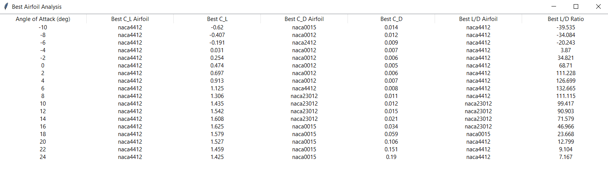

# Airfoil Performance Analysis
## By: André Henriques

This repository contains a Python script for analyzing the performance of different airfoils at various angles of attack. The script uses the XFOIL library to calculate the aerodynamic coefficients (lift, drag, and moment) for each airfoil and angle of attack, and then analyzes the results to determine the best airfoil for each angle of attack.

## Usage

To run the script, simply execute the `main.py` file. The script will generate a CSV file containing the performance data for each airfoil and angle of attack, as well as a PDF file containing plots of the results.

## Configuration

The script can be configured by modifying the following variables at the top of the `main.py` file:

* `AIRFOIL_LIST`: a list of airfoil names to analyze
* `REYNOLDS`: the Reynolds number to use for the analysis
* `ALPHA_RANGE`: the range of angles of attack to analyze

## Output

The script generates two output files:

* `airfoil_performance_table.csv`: a CSV file containing the performance data for each airfoil and angle of attack
* `airfoil_performance_table.pdf`: a PDF file containing plots of the results, including:
	+ Lift coefficient vs. angle of attack for each airfoil
	+ Lift-to-drag ratio vs. angle of attack for each airfoil
	+ Lift coefficient vs. drag coefficient for each airfoil
	+ A table showing the best airfoil for each angle of attack

## GUI

The script also creates a GUI window displaying the best airfoils for each angle of attack.

## Dependencies

The script requires the following libraries:

* `aeropy` 
* `pandas`
* `tabulate`
* `seaborn`
* `matplotlib`
* `tkinter`

And  the software `xfoil` installed 

## License

This script is released under the MIT License. See the `LICENSE` file for details.
